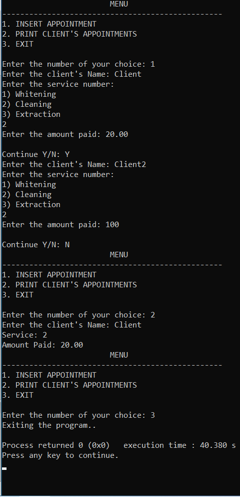
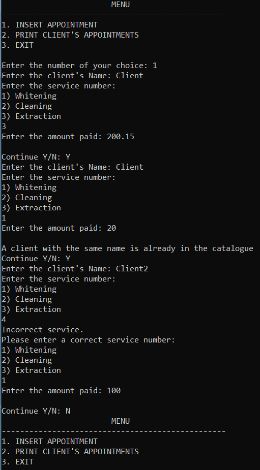

# Dentist-Appointments-With-Hashing
This is a c project. 

In this project, with the use of HashLists, an imitation of a database is being created after running the program. 

Then a menu will appear in the user screen, and the user will enter their choice. 

They have 3 choices: 

1)They can create an appointment by adding in the catalogue the client's name, one of the 3 provided services and at last the amount of money the client has paid 

2)They could search for a client and see everything about their appointment

3)Finally they can just exit the menu and terminate the program.

After adding a new appointment in the catalogue, a message saying "Continue Y/N:" will appear. If the user enter 'Y' the they
will have to add a new client and make another appointment. If they enter 'N', then the menu will pop up.

Also, if the user tries to create an appointment and the name they insert already exist in the catalogue, then a message will appear not allowing the user to enter that name so there are no duplicates.

E.g.:

